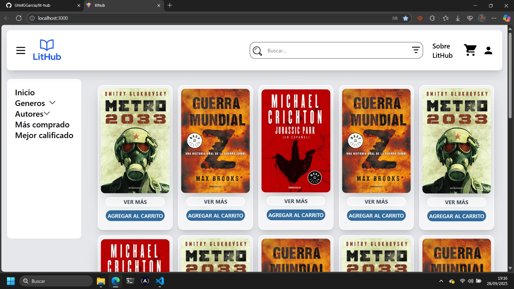
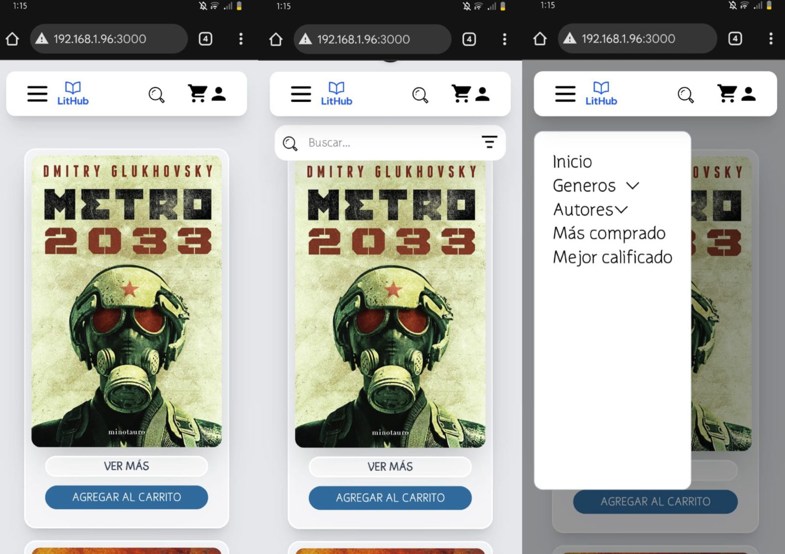

# LitHub


Un **E-commerce de E-books** independientes, creado para que escritores puedan compartir sus obras digitales.

En esta primera versión, los administradores son quienes registran a los autores, y cada autor cuenta con un panel para subir sus propios E-books.

Los usuarios pueden explorar el catálogo, iniciar sesión, pagar en línea con **Stripe**, y recibir sus archivos en formato **.epub** y **.pdf** directamente en su correo electrónico.

A futuro, se podría convertir en un modelo SaaS con planes de suscripción para autores.

---

## Tabla de Contenidos

- [Documentación del proyecto](#documentación-del-proyecto)  
- [Arquitectura y Componentes](#arquitectura-y-componentes)  
- [Pantallas y UI](#pantallas-y-ui)  
- [Requerimientos](#requerimientos)  
- [Contribuciones](#contribuciones)  
- [Tecnologías utilizadas](#tecnologías-utilizadas)  
- [Instalación y uso en local](#instalación-y-uso-en-local)  
- [Despliegue en producción](#despliegue-en-producción)  
- [Vista preliminar de la interfaz](#vista-preliminar-de-la-interfaz)  

---

### Documentación del proyecto
La documentación completa se encuentra en la carpeta `docs/`.  
- [Instalación](docs/instalacion.md) → Cómo instalar y correr el proyecto localmente.  
- [Estilos](docs/estilos.md) → Uso de Tailwind, clases, componentes y responsividad.  
- [Manual de usuario](docs/manual_usuario.md) → Flujo básico y roles de usuarios.

### Arquitectura y Componentes
- [Arquitectura](docs/arquitectura.md) → Organización de carpetas, rutas, componentes principales y hooks.

### Pantallas y UI
- [Pantallas](docs/pantallas.md) → Listado completo de pantallas con descripción.  
- [Historias de usuario](docs/historias_usuario.md) → Historias de usuario, épicos, roles y pantallas asociadas.

### Requerimientos
- [Requerimientos funcionales y no funcionales](docs/requerimientos.md) → Qué hace el sistema y cómo debe comportarse.

---

### Contribuciones
Para colaborar, consulta [CONTRIBUTING.md](CONTRIBUTING.md).

---

## Tecnologías utilizadas

- [React](https://react.dev/)  
- [Vite](https://vitejs.dev/)  
- [TypeScript](https://www.typescriptlang.org/)  
- [React Router](https://reactrouter.com/)  
- [Tailwind CSS](https://tailwindcss.com/)  
- [Stripe](https://stripe.com/)  

---

## Instalación y uso en local

1. Clona este repositorio:

```bash
git clone https://github.com/UrielGGarcia/lit-hub.git
cd lit-hub
```

2. Instala dependencias:

```bash
npm install
```

3. Inicia el entorno de desarrollo:

```bash
npm run dev
```

---

## Despliegue en producción

Actualmente en revisión.  
Lo más probable es que se utilice **Vercel** para despliegue.

Cuando se defina el entorno:

```bash
npm run build
```

---

## Vista preliminar de la interfaz

**PC**  


**Móvil**  
